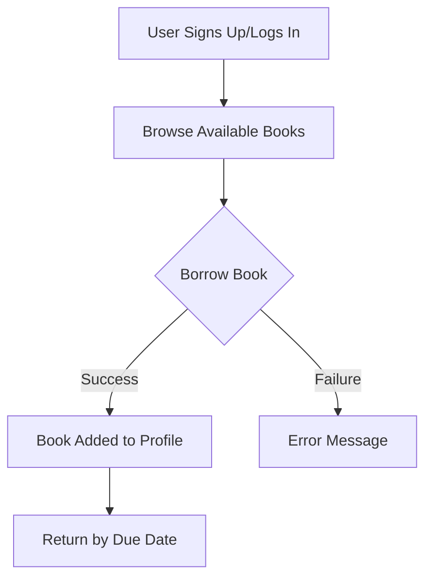

# E-BookStore Library Application


A modern book lending library system with user authentication and borrowing management.

## Features ✨

- User registration/login with secure password hashing
- Book catalog with availability status
- Borrowing system with 2-week due dates
- User profile showing current borrows
- Responsive UI with Tailwind CSS
- Model validations and error handling
- Comprehensive test coverage

## Tech Stack 💻

- **Backend**: Ruby on Rails 8
- **Frontend**: ERB templates + Tailwind CSS
- **Database**: SQLite (development), PostgreSQL (production)
- **Authentication**: Rails' built-in session management
- **Testing**: Rails Minitest framework

## Setup & Installation 🛠️

### Prerequisites

- Ruby 3.2.2
- Node.js (for Tailwind CSS)
- Bundler gem
- SQLite3

### 1. Clone the Repository

```bash
git clone https://github.com/yourusername/library_app.git
cd library_app
```

### 2. Install Dependencies

```bash
bundle install
```

### 3. Database Setup

```bash
rails db:setup
rails db:migrate
rails db:seed
```

### 4. Build Tailwind CSS

```bash
rails tailwind:build
```

### 5. Running the Application 🚀

```bash
rails server
```

Visit ```http://localhost:3000``` in your browser.

### Testing ✅

```bash
rails test
```

- Runs model, controller, and system tests
- Test coverage includes:
- User authentication flows
- Book validations
- Borrowing constraints
- Edge case handling

#### Key Functionality Flow 📚



#### Important Requirements 🔑

- ISBN validation for books
- Prevent double-borrowing of books
- Automatic due date calculation (14 days)
- Responsive design for mobile devices
- Flash messages for user feedback
- Secure password storage with bcrypt
